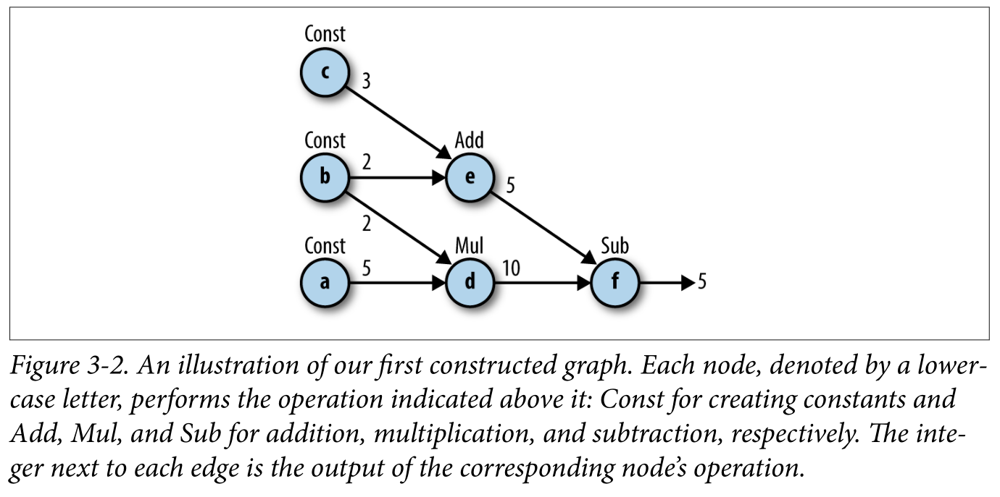
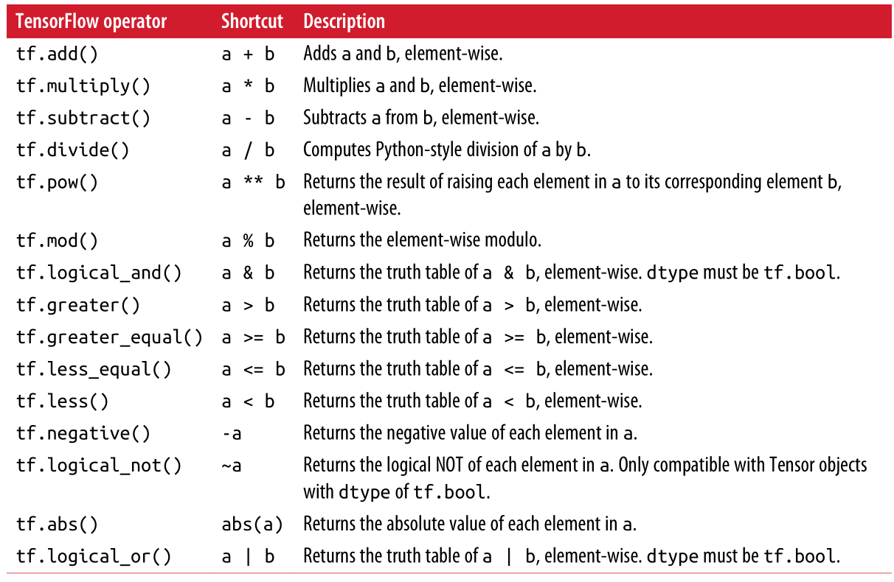

# LearningTensorflow

## CHAPTER 1. Introduction

## CHAPTER 2. Go with the Flow: Up and Running with TensorFlow
- tensorflow 简单示例
    - example2_2.py: MNIST识别，仅将图片像素与权重相乘

## CHAPTER 3. Understanding TensorFlow Basics 
- 计算图(Computation Graph)
    - node: operation(各种函数，运算)
    - edge: flow(数据流，连接各个节点)

- tensorflow 使用步骤
    1. 构建图
    2. 执行图

- 构造图
    - import tensorflow as tf (生成默认图)
    -  tf.<operator> 生成node
    - 示例：
        - 定义常量a, b, c
            - a = tf.constant(5)
            - b = tf.constant(2)
            - c = tf.constant(3)
        - 定义一些运算
            - d = tf.multiply(a, b)
            - e = tf.add(c, d)
            - f = tf.sub(d, e)
        - 由a, b, c, d, e, f 构造图如下
          
        
    - tensorflow 运算符
    

