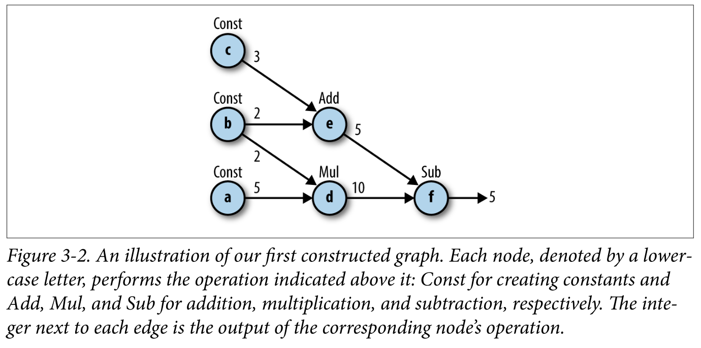
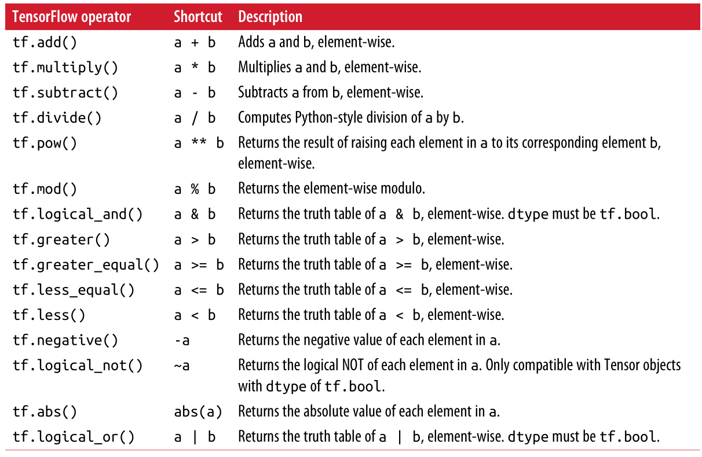
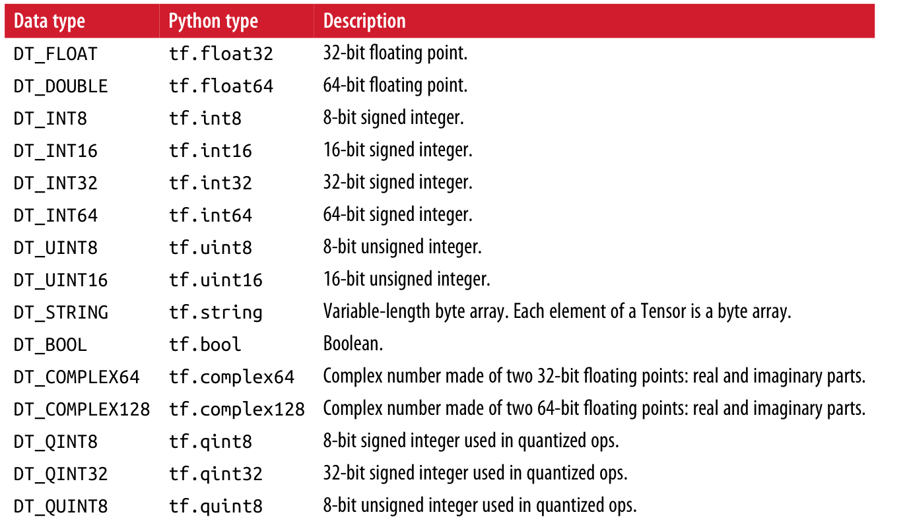
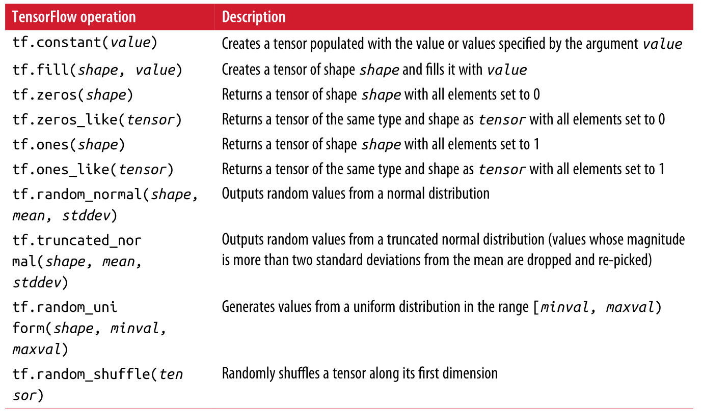
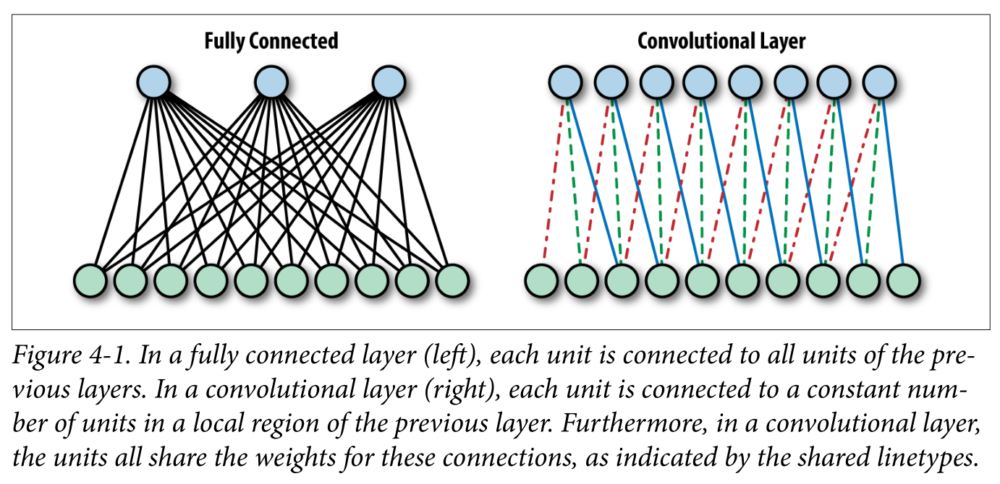
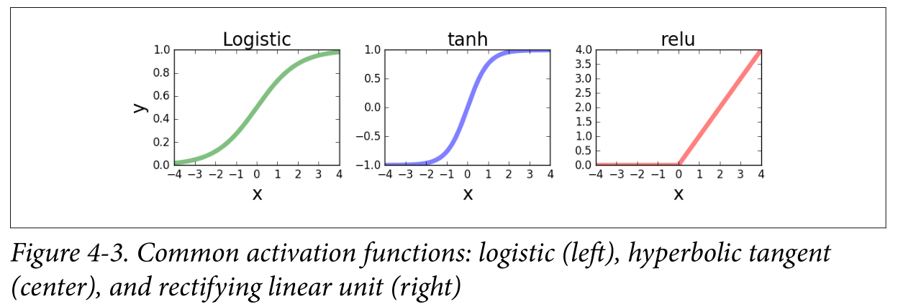
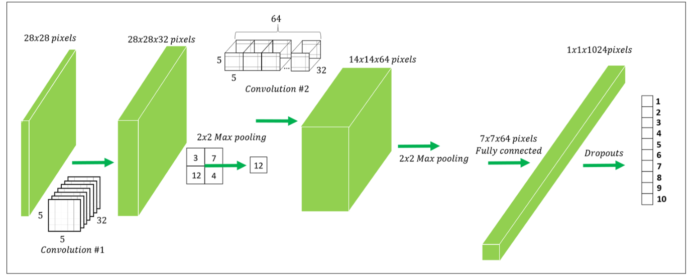
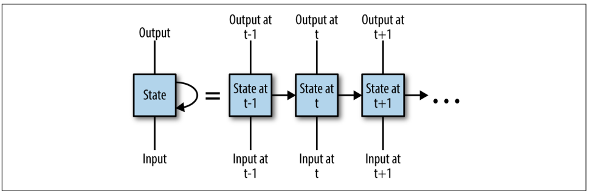

# LearningTensorflow

## CHAPTER 1. Introduction

## CHAPTER 2. Go with the Flow: Up and Running with TensorFlow
- tensorflow 简单示例
    - [MNIST识别，仅将图片像素与权重相乘](./example/example2_2.py)

## CHAPTER 3. Understanding TensorFlow Basics 
- 计算图(Computation Graph)
    - node: operation(各种函数，运算)
    - edge: flow(数据流，连接各个节点)

- tensorflow 使用步骤
    1. 构建图
    2. 执行图

- 构造图
    - import tensorflow as tf (生成默认图)
    -  tf.<operator> 生成node
    - 示例：
        - 定义常量a, b, c
           ```
              a = tf.constant(5)
              b = tf.constant(2)
              c = tf.constant(3)
           ```
    
        - 定义一些运算
            ```
              d = tf.multiply(a, b)
              e = tf.add(c, d)
              f = tf.sub(d, e)
            ```
            
        - 由a, b, c, d, e, f 构造图如下
          
        
    - tensorflow 运算符
    
    
- 构造Session并运行
    - 计算一个值
        ```
        sess = tf.Session()
        outs = sess.run(f)
        sess.close()
        ```
    - Fetches 一次性计算多个值
        ```
        with tf.Session() as sess:
            fetches = [a,b,c,d,e,f]
            outs = sess.run(fetches)
        ```
        
-  数据类型 dtype
    - dtype
        - c = tf.constant(4.0, dtype=tf.float64)
    - 转换数据类型
        ```
        x = tf.constant([1,2,3],name='x',dtype=tf.float32)
        print(x.dtype)
        x = tf.cast(x,tf.int64)
        print(x.dtype)
        
        Out:
        <dtype: 'float32'>
        <dtype: 'int64'>
        ```
    - tensorflow 支持数据类型
        

- Tensor           
    - Tensor 数组及其形状
        - get_shape获得Tensor形状大小
            ```
            import numpy as np
            
            c = tf.constant([[1,2,3],
                             [4,5,6]])
                             
            print("Python List input: {}".format(c.get_shape()))
            
            c = tf.constant(np.array([
                                    [[1,2,3],
                                    [4,5,6]],
                                    [[1,1,1],
                                    [2,2,2]]
                                    ]))
            print("3d NumPy array input: {}".format(c.get_shape()))
            
            
            Out:
            Python list input: (2, 3)
            3d NumPy array input: (2, 2, 3)
            ```
    - Tensor 初始化常用方法
        - tf.constant()  # 常数
        - tf.random_normal()  # 正态分布
        - tf.truncated_normal()  # 截断正态分布
            
        
- 矩阵乘法
    - tf.matmul(a, b)
    - 为矩阵新增一维，tf.expand_dims() 
    - 示例
        ```
        # 2x3
        A = tf.constant([[1,2,3],
                           [4,5,6]])
        # 1x3
        x = tf.constant([1,0,1])
        
        # 将一维转为二维 3x1
        x = tf.expand_dims(x,1)
       
        # 2x1
        b = tf.matmul(A,x)
        
        # 交互式session
        sess = tf.InteractiveSession()
        print('matmul result:\n {}'.format(b.eval()))
        sess.close()
        ```
    - 改变tensor形状, 转置
        - tf.transpose()
        
- 命名空间 Name Scopes
    - 将一些变量放到同一个命名空间方便管理，类似于nodes group
    - 示例
        ```
        with tf.Graph().as_default():
            c1 = tf.constant(4,dtype=tf.float64,name='c')
            with tf.name_scope("prefix_name"):
                c2 = tf.constant(4,dtype=tf.int32,name='c')
                c3 = tf.constant(4,dtype=tf.float64,name='c')
        
        print(c1.name)
        print(c2.name)
        print(c3.name)
        
        Out:
        c:0
        prefix_name/c:0
        prefix_name/c_1:0
        ```
- Variables, Placeholders, and Simple Optimization
    - Variables
        - 创建： tf.Variable()
        - 初始化： tf.global_variables_initializer()
        - 示例：
        ```
        # 正态分布
        init_val = tf.random_normal((1,5),0,1)
        var = tf.Variable(init_val, name='var')
        print("pre run: \n{}".format(var))
        
        init = tf.global_variables_initializer()
        with tf.Session() as sess:
            sess.run(init)
            post_var = sess.run(var)
        print("\npost run: \n{}".format(post_var))
        
        
        Out:
        pre run:
        Tensor("var/read:0", shape=(1, 5), dtype=float32)
        post run:
        [[ 0.85962135 0.64885855 0.25370994 -0.37380791 0.63552463]] 
        ```
        
    - Placeholders
        - 可以看作是空的变量，在后面可以给他赋值
        - 定义： ph = tf.placeholder(tf.float32,shape=(None,10))  # None:任意形状
        - 赋值： sess.run(s,feed_dict={x: X_data,w: w_data})
        - 示例：
        ```
        x_data = np.random.randn(5,10)
        w_data = np.random.randn(10,1)

        with tf.Graph().as_default():
            x = tf.placeholder(tf.float32,shape=(5,10))
            w = tf.placeholder(tf.float32,shape=(10,1))
            b = tf.fill((5,1),-1.)
            xw = tf.matmul(x,w)
            xwb = xw + b
            
            # reduce_max: 取最大值
            s = tf.reduce_max(xwb)
            with tf.Session() as sess:
                outs = sess.run(s,feed_dict={x: x_data,w: w_data})
        
        print("outs = {}".format(outs))
                
        Out:
        outs = 3.06512
        ```
        
    - Optimization
        - 损失函数
            - 均方误差：MSE(mean squared error)
                ```
                loss = tf.reduce_mean(tf.square(y_true-y_pred))
                ```
                
            - 交叉熵：cross entropy
                ```
                loss = tf.nn.sigmoid_cross_entropy_with_logits(labels=y_true,logits=y_pred)
                loss = tf.reduce_mean(loss)
                ```
                
        - 优化器
            - 梯度下降
            - 一般为了加快计算速度，采用随机梯度下降
            - 示例：
            ```
            optimizer = tf.train.GradientDescentOptimizer(learning_rate)
            train = optimizer.minimize(loss)
            ```
- Example
    - [线性回归](./example/example3_1.py)
    - [逻辑回归](./example/example3_2.py)
        
        
## CHAPTER 4. Convolutional Neural Networks  

- 卷积神经网络与全连接网络
    - 全连接网络：各个神经元与所有前一层神经元相连 
    - 卷积神经网络：各个神经元只是与前一层部分神经元相连 
    - 图示：
      
    
    
- 卷积层 (Convolution)
    - tf.nn.conv2d(x, W, strides=[1, 1, 1, 1], padding='SAME')  
        - x: 输入图片
            - [None, 28, 28, 1] ([输入图片个数, 图片长, 图片宽, 通道数])
        - W: 卷积核大小
            - [5, 5, 1, 32] ([卷积核长，卷积核宽，通道数，卷积核数])
        - strides: 卷积核移动步长
        - padding
            - SAME (经卷积后，图片大小不变，为图片加0)
        
- 激活函数 (Activation functions)
    - 卷积操作和全连接层都是线性操作，因此多层网络可以用单层进行替换
    - 激活函数可将线性神经网络变成非线性
    - 常用激活函数：
    
    
- 池化层 (Pooling)
    - Max_Pooling
        - tf.nn.max_pool(x, ksize=[1, 2, 2, 1], strides=[1, 2, 2, 1], padding='SAME')
        - ksize: pooling大小
        - strides: 如何移动
        - padding: 是否补零
        
- Dropout
    - 防止过拟合，训练时将某些神经元赋值为0
    - tf.nn.dropout(layer, keep_prob=keep_prob)
        - keep_prob: 保留的神经元比例
        - 一般训练时keep_prob=0.5, 测试时keep_prob=1.0
        
- MODEL
    - [MNIST](./example/example4_1.py)
    
        
        
# CHAPETR 5. Text I: Working with Text and Sequences, and TensorBoard Visualization

## RNN基本结构图示：
 

## tensorboard
- 步骤
    - tf.summary.scale('name', var)
    - merged = tf.summary.merge_all()
    - write_file = tf.summary.FileWriter('log_path', graph=tf.get_default_graph())
    - summary = sess.run(merged, feed_dict={})
    - write_file.add_summary(summary, i)
- 运行
    - tensorboard --logdir=log_path
    

## RNN解决图像分类
- [采用rnn解决mnist识别](./example/example5_1.py) 

## RNN解决文本问题
- [构造虚拟文本数据集](./example/example5_2_1.py)
    
    
    
    
    
    
    
    

            
    
    
    

